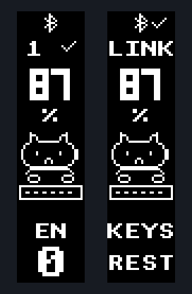

# Восстановление экранов и прошивка Eyelash Sofle

## Что исправлено

Пользователь подтвердил OLED-версию клавиатуры. Прежняя сборка выбирала SPI-дисплей
nice!view, поэтому изменение только управления питанием не решило проблему.
Из `build.yaml` удалён `shield: nice_view` для обеих половин.

В `boards/arm/eyelash_sofle/eyelash_sofle.dtsi` восстановлено подключение OLED
из истории этой платы (коммит `1165a09`, файл `config/boards/arm/sofle/sofle.dtsi`):
SSD1306, 128×32, I2C-адрес 0x3C, SDA=P0.17, SCL=P0.20.
OLED выбран через `zephyr,display`, I2C0 включён, SPI0 отключён.
Работа OLED подтверждена пользователем после прошивки. Теперь стандартный экран
заменён локальным интерфейсом из `src/sofle_display.c`.
Привязки клавиш, матрица и Bluetooth сохранены. Обновлены только подписи слоёв.

Объявление AliExpress не удалось прочитать автоматически. Параметры OLED взяты
из исходной конфигурации производителя, а не подтверждены по маркировке
установленного модуля. После восстановления этой конфигурации экраны заработали.

Предыдущее отключение связи RGB с EXT_POWER сохранено. Это не даёт выключению RGB
отключать питание подключённых устройств; потребление при выключенном RGB
может немного увеличиться. Повторный сброс настроек для перехода на OLED не нужен.

## Новый интерфейс OLED: вертикальный кот-печатник

Экран скомпонован как 32×128: прежний левый край горизонтального изображения
теперь находится снизу. Контроллер остаётся настроен на родные 128×32;
отрисовка переводит портретные координаты в `native_x = 127 - y, native_y = x`.
Это не меняет проверенные настройки SSD1306 и не использует программный поворот
LVGL, рассчитанный на другой формат буфера.

Сверху вниз:

- Пиксельный значок Bluetooth; при вводе по USB слева вместо него показано `USB`.
- Слева номер Bluetooth-профиля и галочка соединения; крестик означает отсутствие
  соединения. Справа `LINK` и галочка/крестик рядом со значком Bluetooth.
- Крупный заряд каждой половины и `%`. При заряде 15% и ниже рядом появляется
  маленькая батарея с восклицательным знаком. Индикатор статический, экран не будит.
- Увеличенный кот за клавиатурой. Нажатия поочерёдно опускают лапы; примерно через
  180–230 мс после последней обработанной порции нажатий лапы возвращаются в покой.
  Кот моргает каждые четыре секунды без печати и закрывает глаза после 15 секунд.
- Слева короткое имя и номер слоя. Справа `KEYS` и состояние кота: `TYPE`
  (печатает), `REST` (отдыхает), `ZZZ` (закрыл глаза).

Названия слоёв сверены с пользователем:

| Слой | Подпись | Назначение |
| --- | --- | --- |
| 0 | EN | Английская раскладка с B L D C |
| 1 | EN-M | Зеркальная английская |
| 2 | NUM | Цифры и символы английской группы |
| 3 | RU | Русская раскладка |
| 4 | RU-M | Зеркальная русская |
| 5 | NUM | Цифры и символы русской группы |

Это названия слоёв ZMK, а не считывание текущего языка Windows. Если сохранённые
настройки Studio содержат старые имена `LAYER0` / `layer1` … `layer5`, экран
автоматически заменяет их понятными подписями. Пользовательские имена из Studio
отображаются первыми четырьмя ASCII-символами в верхнем регистре; для неподдерживаемых
символов используется номер слоя. Сброс Studio для новых подписей не требуется.

Левый кот реагирует на нажатия обеих половин, правый — на местные клавиши.
Анимация отражает события нажатия, а не повтор символов при удержании в ОС.
Быстрые нажатия объединяются до одного обновления за 50 мс. Отпускания не
запускают новый удар лапой, а сама анимация не продлевает активность клавиатуры.

Примерно через 30 секунд без ввода OLED и обработка анимации отключаются.
Нажатие пробуждает экран. ZMK учитывает активность каждой половины: при вводе
только слева правый экран может погаснуть раньше. Общий глубокий сон через час
сохранён. Таймер задаётся в `config/eyelash_sofle.conf`:
`CONFIG_ZMK_IDLE_TIMEOUT=30000` (миллисекунды); он также влияет на idle для RGB.



Предпросмотр получен отрисовкой кода интерфейса в LVGL; заряд 87% и подключение —
тестовые данные. В GIF показаны нажатия и последующая пауза.

## 1. Собрать новые файлы UF2

Из PowerShell в папке проекта отправь изменения в свой репозиторий:

```powershell
Set-Location C:\zmk-sofle
git add .github/workflows/build.yml .github/workflows/build-user-config.yml .github/workflows/draw.yml src/sofle_display.c config/eyelash_sofle.keymap docs/oled-preview.png docs/oled-preview.gif FLASHING_RU.md
git commit -m "Polish OLED cat UI and migrate build actions to Node 24"
git push origin main
```

Открой [GitHub Actions своего репозитория](https://github.com/ReLLLDev/zmk-sofle/actions),
выбери **Build ZMK firmware** для нового коммита и дождись успешного завершения
всех сборок. В разделе **Artifacts** скачай архив **firmware** и распакуй его.
Повторный запуск старой сборки без отправки изменений исправление не включает.

| Файл | Назначение |
| --- | --- |
| `eyelash_sofle_right.uf2` | Правая половина |
| `eyelash_sofle_studio_left.uf2` | Левая половина, с поддержкой Studio |
| `settings_reset-nice_nano_v2-zmk.uf2` | Сервисный сброс настроек, только при необходимости |

Это ожидаемые имена файлов по матрице сборки; готовые UF2 в репозитории не поставляются.

## 2. Прошить правую половину

1. Подключи правую половину к компьютеру USB-кабелем с передачей данных.
2. Быстро нажми её физическую кнопку **Reset два раза**. Должен появиться
   съёмный диск загрузчика. Название диска зависит от загрузчика.
3. Скопируй `eyelash_sofle_right.uf2` в корень этого диска.
4. Дождись завершения копирования: диск обычно исчезает, а контроллер перезапускается.
5. Отключи USB от правой половины.

## 3. Прошить левую половину

1. Подключи левую половину по USB.
2. Дважды быстро нажми её **Reset**.
3. Скопируй `eyelash_sofle_studio_left.uf2` на появившийся диск.
4. Дождись перезапуска. Включи обе половины и при необходимости однократно
   нажми Reset на обеих примерно одновременно.

Левая половина — центральная: именно она подключается к компьютеру для ввода
по USB или Bluetooth и для работы со Studio. Правая связывается с ней автоматически.
Используй оба файла из одного нового архива.

## 4. Проверить экраны

1. Проверь вертикальную ориентацию: прежний левый край стал низом, текст читается
   сверху вниз. Проверь значок Bluetooth, крупный заряд и кота на обеих половинах.
   При нажатиях лапы должны двигаться, при паузе — останавливаться.
2. Переключи слой: имя и номер должны измениться слева. Проверь EN/RU, NUM,
   зеркальные слои, USB и Bluetooth. Перед погасанием кот должен закрыть глаза.
3. Не трогай клавиши и энкодеры 35 секунд: оба экрана должны погаснуть.
4. Нажми клавишу справа, затем слева: проверь пробуждение и возобновление анимации.
5. Повтори проверку от батарей; отдельно проверь пробуждение после часового сна.

Для обновления интерфейса `settings_reset` не нужен: прошей два обычных UF2.

## Если экраны остаются пустыми или половины не соединяются

ZMK сохраняет состояние внешнего питания во flash. Обычная прошивка UF2
не очищает его, поэтому старое выключенное состояние может остаться.

Следующая процедура удалит сохранённые настройки, в том числе Bluetooth-сопряжения
и изменения раскладки в Studio. Сохрани нужные настройки перед сбросом.
Сервисный образ `nice_nano_v2` уже предусмотрен исходной матрицей этого проекта.

1. Через двойное нажатие Reset прошей `settings_reset-nice_nano_v2-zmk.uf2`
   на правую половину; дай ей загрузиться и подожди несколько секунд.
2. Повтори сброс на левой половине. Сначала сбрось обе, затем ставь обычную прошивку.
3. Снова войди в загрузчик на каждой половине и прошей соответствующий обычный UF2
   по инструкции выше. Сервисная прошивка не предназначена для набора текста.
4. Перезапусти обе половины примерно одновременно.
5. Удали старое Bluetooth-устройство клавиатуры в Windows и выполни сопряжение заново.

Если сброс уже выполнялся, не повторяй его из-за пустых экранов: сначала установи
новую OLED-сборку. Если и она не помогает, нужны маркировка/фото дисплея и проверка
его I2C-адреса и питания.

## Проверка изменений

Код API и механизм гашения сверены с исходниками ZMK v0.3.0.
Интерфейс скомпилирован GCC на компьютере для центральной и периферийной роли
с LVGL из закреплённой зависимости Zephyr
(`8a6a2d1d29d17d1e4bdc94c243c146a39d635fdd`). Проверены тестовые состояния:
заряд 87/100%, слой 0/5, USB, подключённый/отключённый Bluetooth, связь половин
и смена кадров. Дополнительно проверены чередование лап при нажатиях, отсутствие
нового удара при отпускании, возврат к идентичному кадру покоя, возобновление
обработки после длительной паузы и отрисовка вертикального экрана при заряде
0/87/100%, порог индикатора 15/16%, моргание, засыпание и открытие глаз при
нажатии. Проверены подписи старых слоёв Studio, пользовательских имён и резервное
отображение номера для неподдерживаемых символов. Для этой проверки функции ZMK заменены тестовыми значениями;
это проверка графики, а не полная сборка прошивки или проверка Bluetooth.

Локальный Docker Engine недоступен. Полная компиляция UF2 и проверка гашения /
пробуждения на клавиатуре ещё нужны. Сборочный сценарий v0.3.0 перенесён в локальный
`.github/workflows/build-user-config.yml`: изменены только ссылки на действия.
`checkout` v5.0.0, `cache` v5.0.0, `upload-artifact` и `merge` v6.0.0 закреплены
полными SHA; их `action.yml` используют Node.js 24. `config/west.yml` по-прежнему
выбирает ZMK v0.3.0. Проверка actionlint прошла для всех локальных workflows.
В `draw.yml` также исправлен тип `fail_on_error`: вместо `fromJSON(true)` — `true`.
Новый запуск Actions ещё нужен для проверки выполнения сценария на GitHub.

Источники: [цикл обновления и гашение дисплея ZMK v0.3.0](https://github.com/zmkfirmware/zmk/blob/v0.3.0/app/src/display/main.c),
[активность и сон](https://github.com/zmkfirmware/zmk/blob/v0.3.0/app/src/activity.c),
[потокобезопасные обновления виджетов](https://github.com/zmkfirmware/zmk/blob/v0.3.0/app/include/zmk/display.h).
